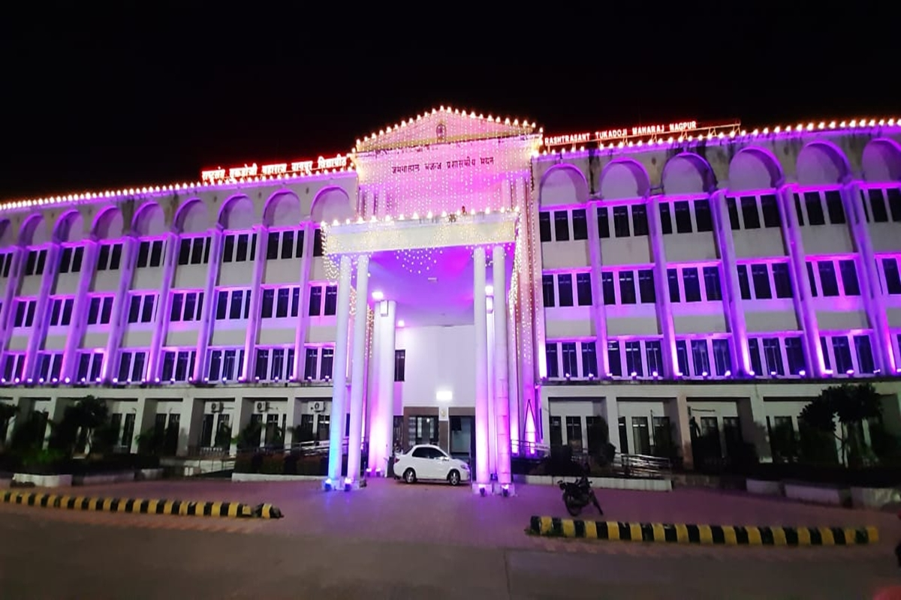

# 🎓 Student Result Management System

<p align="center">

  

  

  

  

</p>

<p align="center">

<strong>A web-based Student Result Management System built using Java Servlets, JSP, HTML, CSS, JavaScript and MySQL.</strong>

</p>

<p align="center">

  <a href="https://github.com/vaibhaokamble/Student-Result-Management-System">
    
  </a>

</p>

---

## 📌 Overview

The **Student Result Management System** is a web-based application developed to simplify the management and viewing of student academic results.

The system provides separate workflows for **administrators and students**, allowing administrators to manage student information and results while students can view their academic performance.

The project demonstrates practical implementation of:

* ☕ Core Java
* 🌐 Java Servlets
* 📄 JSP
* 🗄️ MySQL
* 🎨 HTML & CSS
* ⚡ JavaScript
* 🔗 JDBC
* 🖥️ Apache Tomcat

---

## 🎯 Project Objectives

The primary objective of this project is to provide a simple and centralized platform for managing student academic results.

### Key objectives

* 👨‍🎓 Manage student information
* 📝 Add and manage examination results
* 🔐 Provide administrator authentication
* 🔎 Search and view student results
* 📊 Display academic performance
* 🖨️ Provide printable result information
* 🗄️ Store student and result data in MySQL
* 🌐 Provide a browser-based interface

---

## ✨ Features

### 👨‍💼 Administrator

* 🔐 Admin Login
* 👨‍🎓 Add New Student
* 📝 Insert Student Results
* 📋 View Student Information
* 🔎 Search Student Results
* 📊 Manage Academic Records
* 🖨️ Print Result
* 🚪 Logout

### 👨‍🎓 Student

* 🔎 Search/View Result
* 📊 View Academic Performance
* 📄 View Result Details
* 🖨️ Print Result

---

## 🏗️ Application Architecture

```text
                    ┌──────────────────────┐
                    │       Browser        │
                    │  HTML / CSS / JS     │
                    └──────────┬───────────┘
                               │
                               │ HTTP Request
                               ▼
                    ┌──────────────────────┐
                    │    Apache Tomcat     │
                    │    Web Container     │
                    └──────────┬───────────┘
                               │
                 ┌─────────────┴─────────────┐
                 │                           │
                 ▼                           ▼
        ┌─────────────────┐         ┌─────────────────┐
        │ Java Servlets   │         │      JSP        │
        │ Business Logic  │         │ Presentation    │
        └────────┬────────┘         └────────┬────────┘
                 │                           │
                 └─────────────┬─────────────┘
                               │
                               │ JDBC
                               ▼
                    ┌──────────────────────┐
                    │        MySQL         │
                    │      Database        │
                    └──────────────────────┘
```

---

## 🔄 Application Flow

```text
                  START
                    │
                    ▼
             Open Application
                    │
                    ▼
            ┌───────────────┐
            │    Login?     │
            └───────┬───────┘
                    │
          ┌─────────┴─────────┐
          │                   │
          ▼                   ▼
       Admin               Student
          │                   │
          ▼                   ▼
    Admin Login         Search Result
          │                   │
          ▼                   ▼
     Dashboard            View Result
          │                   │
     ┌────┴─────┐             │
     │          │             │
     ▼          ▼             ▼
  Student     Result       Print Result
  Management  Management       │
     │          │              │
     └────┬─────┘              │
          │                    │
          └──────────┬─────────┘
                     ▼
                   MySQL
                     │
                     ▼
                    END
```

---

## 🛠️ Technology Stack

### Backend

| Technology        | Purpose                                  |
| ----------------- | ---------------------------------------- |
| ☕ Java            | Application programming language         |
| 🔗 Java Servlets  | Request processing and server-side logic |
| 📄 JSP            | Dynamic web pages                        |
| 🔌 JDBC           | Database connectivity                    |
| 🖥️ Apache Tomcat | Web application server                   |

### Frontend

| Technology   | Purpose                 |
| ------------ | ----------------------- |
| HTML5        | Page structure          |
| CSS3         | Styling                 |
| JavaScript   | Client-side interaction |
| Font Awesome | Icons                   |
| jQuery       | JavaScript utilities    |

### Database

| Technology        | Purpose                   |
| ----------------- | ------------------------- |
| MySQL             | Persistent data storage   |
| MySQL Connector/J | Java ↔ MySQL connectivity |

---

## 📂 Project Structure

```text
Student-Result-Management-System/
│
├── META-INF/
│   └── MANIFEST.MF
│
├── WEB-INF/
│   ├── lib/
│   │   ├── mysql-connector-java-8.0.11.jar
│   │   └── servlet-api.jar
│   │
│   └── web.xml
│
├── assets/
│   ├── css/
│   │   ├── font-awesome.min.css
│   │   └── main.css
│   │
│   ├── fonts/
│   │   └── ...
│   │
│   └── js/
│       ├── jquery.min.js
│       ├── main.js
│       ├── skel.min.js
│       └── util.js
│
├── images/
│   └── home1.jpeg
│
├── addNewStudent.jsp
├── adminHome.jsp
├── adminLogin.html
├── adminLoginAction.jsp
├── dgiOneView.html
├── errorAdminLogin.html
├── errorDgiOneView.html
├── header.html
├── index.html
├── insertNewResult.jsp
├── image.jpg
├── logo.jpeg
├── print.png
├── result.png
│
└── README.md
```

---

## 🔐 Authentication Flow

The administrator authentication follows a traditional server-side web flow:

```text
Admin
  │
  ▼
adminLogin.html
  │
  │ Login Credentials
  ▼
adminLoginAction.jsp
  │
  │ Validate Credentials
  ▼
    ┌───────────────┐
    │   Valid ?     │
    └───────┬───────┘
            │
      ┌─────┴─────┐
      │           │
     YES          NO
      │           │
      ▼           ▼
adminHome.jsp   Error Page
```

---

## 🔄 Student Result Flow

```text
Student
   │
   ▼
Enter Student Information
   │
   ▼
Request Result
   │
   ▼
Servlet / JSP Processing
   │
   ▼
JDBC
   │
   ▼
MySQL
   │
   ▼
Fetch Result
   │
   ▼
Display Result
   │
   ▼
Print / View
```

---

## 🗄️ Database Architecture

The application uses **MySQL** as its persistent data store.

A simplified conceptual model is:

```text
┌─────────────────────┐
│       STUDENT       │
├─────────────────────┤
│ student_id          │
│ student_name        │
│ course              │
│ ...                 │
└──────────┬──────────┘
           │
           │ 1 : N
           │
           ▼
┌─────────────────────┐
│       RESULT        │
├─────────────────────┤
│ result_id           │
│ student_id          │
│ subject             │
│ marks               │
│ grade               │
│ ...                 │
└─────────────────────┘

┌─────────────────────┐
│       ADMIN         │
├─────────────────────┤
│ admin_id            │
│ username            │
│ password            │
└─────────────────────┘
```

> **Note:** The exact database schema depends on the MySQL database used with the application.

---

## 🚀 Getting Started

### Prerequisites

Before running the project, install:

* ☕ JDK
* 🐬 MySQL Server
* 🖥️ Apache Tomcat
* 🌐 Web Browser
* 💻 Eclipse / IntelliJ IDEA / STS

Recommended environment:

```text
Java
MySQL
Apache Tomcat 8+
```

---

## ⚙️ Installation

### 1️⃣ Clone Repository

```bash
git clone https://github.com/vaibhaokamble/Student-Result-Management-System.git
```

### 2️⃣ Navigate to Project

```bash
cd Student-Result-Management-System
```

### 3️⃣ Configure MySQL

Create the required MySQL database and tables according to the application's database configuration.

Example:

```sql
CREATE DATABASE student_result_management;
```

Then configure the database credentials used by the JSP/JDBC code.

```text
Database Host : localhost
Database Port : 3306
Database Name : student_result_management
Username      : root
Password      : your_password
```

> Replace the values with your local MySQL configuration.

---

## 🖥️ Run Using Apache Tomcat

### Step 1

Install and configure **Apache Tomcat**.

### Step 2

Deploy the project as a web application.

### Step 3

Start Tomcat.

### Step 4

Open the application in your browser.

```text
http://localhost:8080/Student-Result-Management-System/
```

The exact URL may vary depending on the deployed application context.

---

## 🔌 JDBC Database Flow

The application follows a traditional JDBC architecture:

```text
JSP / Servlet
      │
      ▼
 JDBC Driver
      │
      ▼
 DriverManager
      │
      ▼
 Connection
      │
      ▼
 PreparedStatement
      │
      ▼
 MySQL
      │
      ▼
 ResultSet
      │
      ▼
 JSP / Response
```

---

## 🧠 What This Project Demonstrates

This project demonstrates practical understanding of traditional Java web development.

### Java

* Core Java
* OOP concepts
* Exception handling
* JDBC
* Server-side programming

### Java Web

* Servlets
* JSP
* HTTP requests
* HTTP responses
* Session handling
* Web application deployment
* `web.xml` configuration

### Database

* MySQL
* SQL
* CRUD operations
* JDBC connectivity
* Relational data management

### Frontend

* HTML
* CSS
* JavaScript
* jQuery
* Responsive UI

---

## 🔍 Example Request Flow

When a user requests a result:

```text
1. User opens result page
          │
          ▼
2. Browser sends HTTP request
          │
          ▼
3. Tomcat receives request
          │
          ▼
4. Servlet/JSP processes request
          │
          ▼
5. JDBC creates database connection
          │
          ▼
6. SQL query executes
          │
          ▼
7. MySQL returns ResultSet
          │
          ▼
8. Application processes result
          │
          ▼
9. JSP generates HTML
          │
          ▼
10. Browser displays result
```

---

## 🧪 Testing

The application can be manually tested using scenarios such as:

| Test Case              | Expected Result             |
| ---------------------- | --------------------------- |
| Valid Admin Login      | Dashboard opens             |
| Invalid Admin Login    | Error message displayed     |
| Add Student            | Student record created      |
| Insert Result          | Result stored successfully  |
| Search Valid Student   | Student result displayed    |
| Search Invalid Student | Appropriate error displayed |
| Print Result           | Printable result generated  |
| Logout                 | Session terminated          |

---

## 🔒 Security Considerations

This project is based on a traditional JSP/Servlet architecture. For a modern production deployment, the following improvements are recommended:

* 🔐 Hash passwords using BCrypt/Argon2
* 🛡️ Use PreparedStatement for all database queries
* 🔒 Implement secure session management
* 🚫 Prevent SQL Injection
* 🧹 Validate and sanitize user input
* 🔑 Avoid hard-coded database credentials
* 🔒 Use HTTPS in production
* 🛡️ Add CSRF protection
* ⏱️ Configure session timeout
* 📝 Add application logging

---

## ⚡ Future Improvements

The project can be modernized with:

### Backend

* 🚀 Spring Boot
* 🌐 REST APIs
* 🔐 Spring Security
* 🎟️ JWT Authentication
* 🧩 Service/Repository architecture
* 🧪 JUnit & Mockito
* 📖 Swagger / OpenAPI

### Frontend

* ⚛️ React.js
* 🎨 Tailwind CSS
* 📊 Interactive result dashboard
* 📱 Improved responsive UI

### Database

* 🐬 MySQL optimization
* 🔗 Proper foreign-key relationships
* 📊 Database normalization
* ⚡ Query optimization

### DevOps

* 🐳 Docker
* ☁️ AWS
* 🔄 CI/CD
* 📦 Automated deployment

---

## 🏆 Learning Outcomes

Through this project, the following concepts can be practiced:

```text
Java
 │
 ├── OOP
 │
 ├── JDBC
 │
 ├── Servlets
 │
 └── JSP
       │
       ▼
     Tomcat
       │
       ▼
     MySQL
```

The project provides a strong foundation for understanding how traditional Java web applications work before moving toward modern frameworks such as **Spring Boot and React**.

---

## 📸 Screenshots

You can add screenshots of the application here:

```markdown

```

Recommended screenshots:

* 🏠 Home Page
* 🔐 Admin Login
* 📊 Admin Dashboard
* 👨‍🎓 Add Student
* 📝 Add Result
* 📄 Student Result
* 🖨️ Print Result

---

## 👨‍💻 Developer

### Vaibhao Kamble

**Java Full Stack Developer**

I build secure, scalable and maintainable applications using Java, Spring Boot, React.js, databases and modern development practices.

### Technical Focus

```text
Java
Spring Boot
Spring Security
REST APIs
Microservices
React.js
MySQL
PostgreSQL
Docker
AWS
Git & GitHub
```

---

## 🤝 Connect With Me

<p align="center">

<a href="https://github.com/vaibhaokamble">

</a>

<a href="https://linkedin.com/in/vaibhaokamble">

</a>

</p>

---

## ⭐ Support

If you find this project useful, please consider giving it a ⭐ on GitHub.

It helps support the project and encourages continued development.

---

<p align="center">

### ☕ Code • Learn • Build • Improve

**Built with ❤️ by Vaibhao Kamble**

</p>
